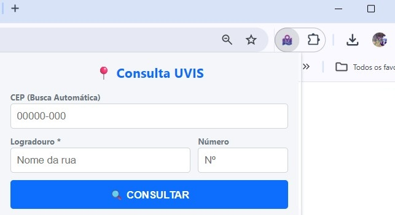
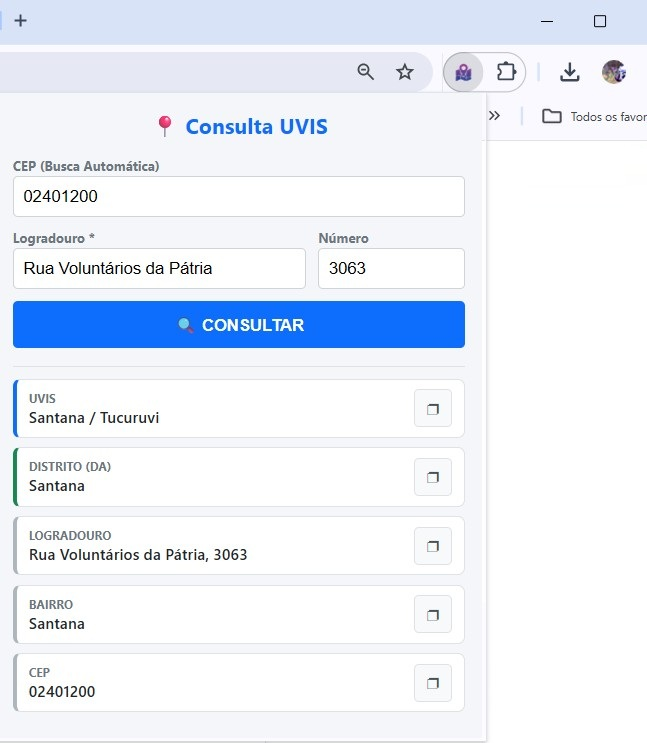

# Extensão - Consulta UVIS e UBS (São Paulo)
Consulta a **Unidade de Vigilância em Saúde (UVIS)**, **Distrito Administrativo (DA)** e a **Unidade Básica de Saúde (UBS)** de qualquer endereço diretamente pelo navegador.

[**Baixe a Extensão na Chrome Web Store ↗**](https://chromewebstore.google.com/detail/localizador-uvis-e-ubs/ohhkpccnilhbbhgeidmajpghpjgpipcc)

**[Acesse a versão Web clicando aqui](https://wellingtonlb.github.io/consulta-uvis/)**

---
## Instalação

A maneira mais segura e fácil é instalar através da loja oficial:

1. Acesse a página na **[Chrome Web Store]**.
2. Clique em **"Usar no Chrome"**.
3. O ícone aparecerá na sua barra de tarefas.

## Sobre

Este projeto é **Open Source**. Foi priorizada a privacidade e a transparência.

* **Manifest V3:** Segue os padrões mais recentes de segurança do Google.
* **Sem Rastreamento:** Nenhuma informação pessoal ou de navegação é coletada.
* **APIs Públicas:** Utiliza Nominatim (OSM) e ViaCEP para consultas em tempo real.
* **Turf.js:** Processamento matemático dos polígonos feito localmente no seu navegador.

---
## Como funciona

A extensão é simples e direta. Veja o fluxo de uso:

| 1️⃣ Digite o Endereço ou CEP | 2️⃣ Receba os Dados da UVIS/DA |
| :---: | :---: |
|  |  |

---

## Suporte e Contribuição

Encontrou um erro ou o mapa não bateu com a realidade?
* Abra uma **[Issue](https://github.com/wellingtonlb/territorio_uvis/issues)** aqui no GitHub.
* Ou envie um e-mail através da página da Chrome Web Store.

**[Acesse o repositório da versão Web clicando aqui](https://github.com/wellingtonlb/consulta-uvis/)**
---

## Licença

Distribuído sob a licença MIT. Veja `LICENSE` para mais informações.

[Wellingtonlb](https://github.com/wellingtonlb)
